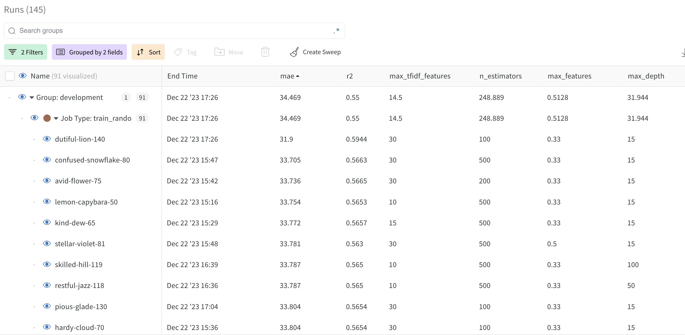
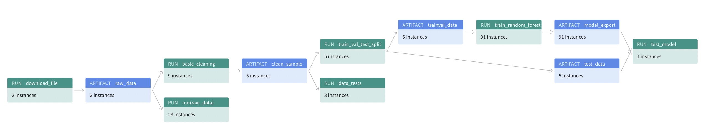

# NYC Short-Term Rental Price Prediction Pipeline

## Overview
This ML pipeline predicts short-term rental prices in NYC. It automates the process of data ingestion, cleaning, 
testing, training, and evaluation, ensuring robust and efficient weekly updates with new data sets. The pipeline is
built using [MLflow](https://mlflow.org/) and [Hydra](https://hydra.cc/). It is deployed on [Weights & Biases](https://wandb.ai/).


## Links
- [W&B Project](https://wandb.ai/jeroencvlier/nyc_airbnb) -> For the latest public results and pipeline visualization.
- [GitHub Repository](https://github.com/jeroencvlier/build-ml-pipeline-for-short-term-rental-prices) -> For the source code.
- [Latest Release](https://github.com/jeroencvlier/build-ml-pipeline-for-short-term-rental-prices/releases/latest) -> For the latest release.

## Getting Started
### Prerequisites
- [Miniconda](https://docs.conda.io/en/latest/miniconda.html)
- [Git](https://git-scm.com/downloads)

### Installation
1. **Clone the Repository**
   ```bash
   git clone https://github.com/jeroencvlier/build-ml-pipeline-for-short-term-rental-prices.git
   cd build-ml-pipeline-for-short-term-rental-prices
   ```

2. **Create and Activate the Conda Environment**

   ```bash
   conda env create -f environment.yml
   conda activate nyc_airbnb_dev
   ```

3. **Initialize Weights & Biases**
To use Weights & Biases you need to create an account and login with an API key.

   ```bash
   wandb login
   ```

## Pipeline Components
- **Data Download**: Fetches the latest rental data.
- **Basic Cleaning**: Cleans the dataset by handling outliers and missing values.
- **Data Testing**: Ensures data quality and consistency.
- **Data Splitting**: Segregates the dataset into training, validation, and test sets.
- **Model Training**: Trains a Random Forest model.
- **Hyperparameter Optimization**: Fine-tunes the model parameters.
- **Model Testing**: Evaluates the model's performance on the test set.
- **Visualization**: Provides insights into the model's performance and data flow.

## Usage
Run the entire pipeline 
```bash
mlflow run . 
```

or specific components using MLflow [
    "download",
    "basic_cleaning",
    "data_check",
    "data_split",
    "train_random_forest",
]:

```bash
mlflow run . -P steps=step_name
```
To run with custom configurations:
```bash
mlflow run . -P hydra_options="your_configuration"
```

To retrain the model with new data:
```bash
mlflow run https://github.com/jeroencvlier/build-ml-pipeline-for-short-term-rental-prices.git -v 1.0.4 -P hydra_options="etl.sample='sample2.csv'"
```

## Training results
The best model achieved an R2 score of 0.566 and a mean absolute error of 33.734. While this is the
best result, we decided to pick a leaner model (v104) which scored an r2 of 0.5634 and a mean absolute error of 33.802
and the following hyperparameters:

| Parameter | Value |
| :--- | :--- |
| n_estimators | 200 |
| max_depth | 100 |
| max_features | 0.5 |
| max_tfidf_features | 30 |

After retraining the model on new data we got an R2 score of 0.5978 and a mean absolute error of 31.616.



## Pipeline Visualization
Visualization of the pipeline using Weights & Biases.


## License
Distributed under the MIT License. See [LICENSE](LICENSE.txt) for more information.

---

Project developed as part of the [Udacity Machine Learning Operations Nanodegree](https://www.udacity.com/course/machine-learning-dev-ops-engineer-nanodegree--nd0821).
